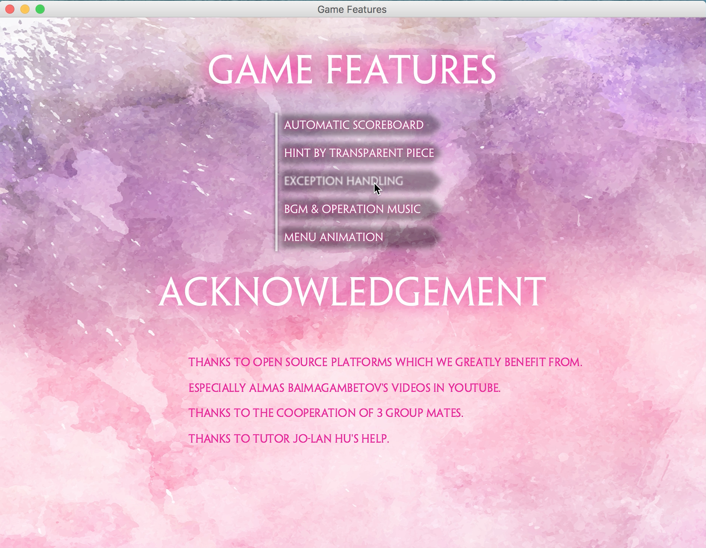
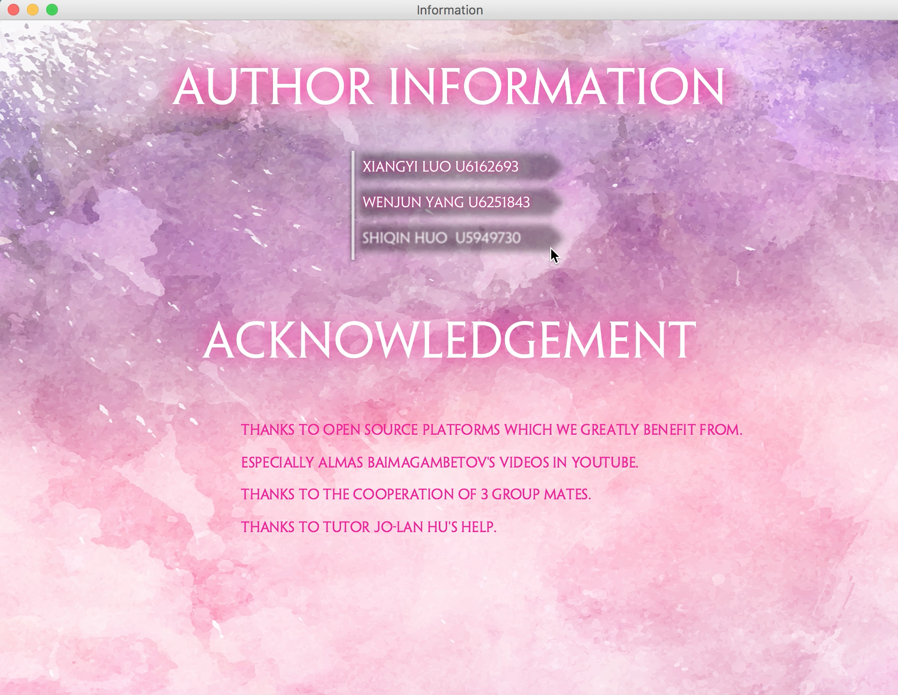
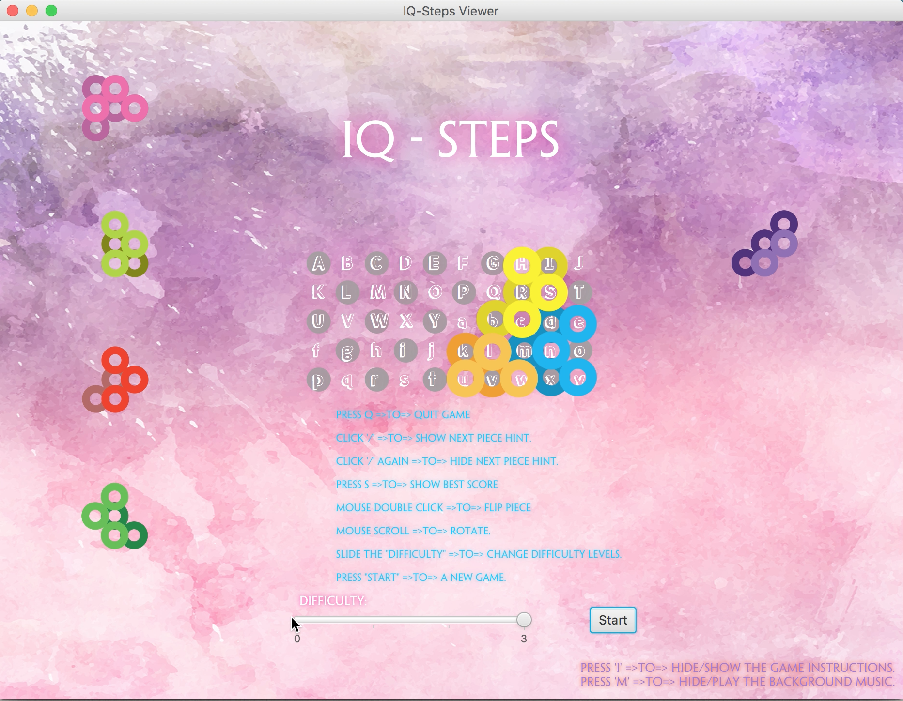
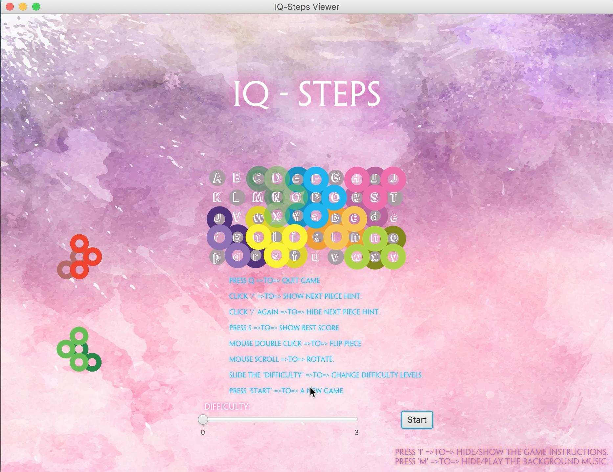
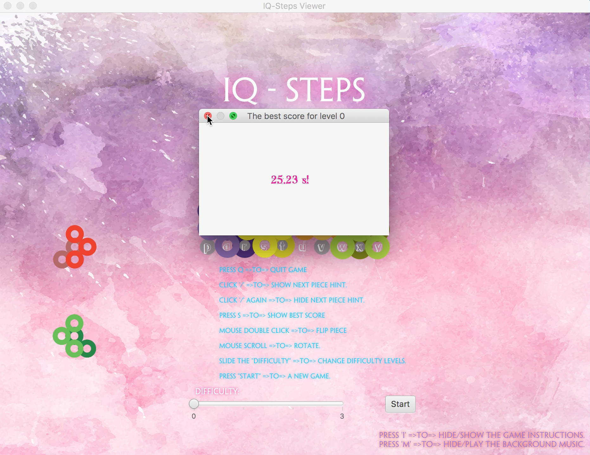

# IQ-Step_board_game

Double-layer Board Game (JavaFX GUI) with AI hints Solver &amp; Generator - ANU@COMP1110 Assignment 2

**Welcome Stars and Comments! mailto:ShiqinHuo@gmail.com**

## Demo Video
[Youtube Video for Demo](https://youtu.be/u260SR7zm-0)

## QuickStart
Run [game.jar](https://github.com/ShiqinHuo/IQ-Step_board_game/blob/master/game.jar)

## Sample GUI

Game Menu            |  Game Features
:-------------------------:|:-------------------------:
  |  

Author Info           |  Game Viewer
:-------------------------:|:-------------------------:
  |  

Hint Viewer         |  ScoreBoard
:-------------------------:|:-------------------------:
  |  

## Presentation

[Slides for Presentation](https://github.com/ShiqinHuo/IQ-Step_board_game/blob/master/presentation.pdf)

## Requirements
[Instruction](https://github.com/ShiqinHuo/IQ-Step_board_game/blob/master/Instruction.md)

## Related Links
[YouTuber Almas Baimagambetov's Channel](https://www.youtube.com/almasb0/videos)
